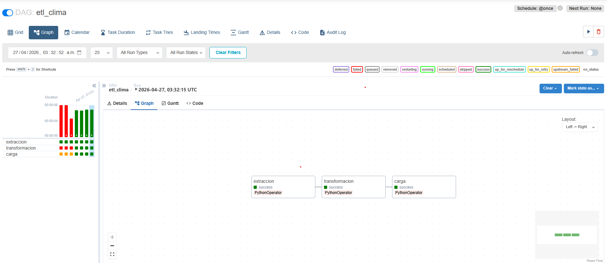

# Proyecto ETL para datos del clima(temperatura °C y precipitacion en mm).
Se realizó un etl para cargar datos a un archivo .db y así de obtener métricas de clima(temperatura en °C y precipitación en mm) realizando consultas SQL. La fuente de datos de origen se recuperan a a través de la API Open Meteo.  

## Tecnologías empleadas
*Lenguaje:Python(requests,logging,pandas,json,SQLAlchemy)
*Orquestador: Airflow
*Contenedor:Docker
*Base de Datos: SQLite3
*SO:WSL2 (Ubuntu)

### Etapas del Pipeline
#### Extracción
Se realiza la extracción desde la API de Open Meteo,los datos se almacenan en un archivo csv y se retorna la ruta de ubicación del archivo.
### Transformación
Se recibe el path del archivo csv y se procede a realizar una serie de acciones como cambiar el nombre de columnas, tipo de datos y la realización de un filtrado así como la muestra de un resumen para imprimir en pantalla numeros nulos y negativos.
### Carga
Se cargan los datos transformados a la tabla "mi_clima" que se encuentra dentro de la bd "clima.db" .

### Ejecución
Es posible realizar la ejecución del ETL a través del script "Cargador.py" el cual además mostrara los resultados de una serie de queries. 
También es posible ejecutar el ETL a través de Apache Airflow ya que esta planteado el DAG del ETL dentro del proyecto.

### Reflexión
Decisiones técnicas: Es importante considerar que se emplea el uso de archivos csv como almacenamiento algo que en otras circunstancias podría resultar limitante debido tal vez a la
cantidad de datos que se requiera almacenar, por ello la acción de emplear rutas(donde almacenan csv) para ser introducidas como parámetros en lugar de dataframes. Los errores se manejaron a través de excepciones y empleando loggings en lugar de impresiones en pantalla.

Mejoras(a falta de tiempo): Profundizar en el tema de los errores manejados a través de las excepciones así como llevar el proyecto a un entorno situado en algún servicio en la nube.

### Anexos: 

Imagen del proceso realizado empleando Apache Airflow

